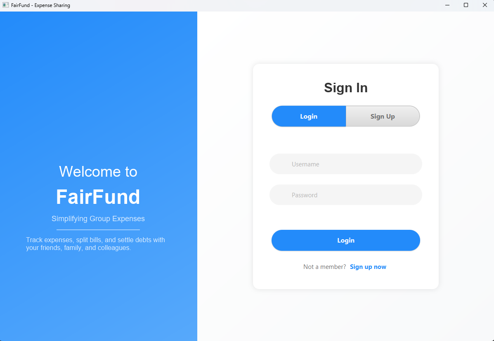

# FairFund - Expense Sharing & Management System

<p align="center">
  
</p>

## Overview

FairFund is a powerful, intuitive expense sharing and management application built with JavaFX. Designed with user experience in mind, it offers a sleek interface for creating groups, tracking expenses, settling debts, and managing shared finances with precision and ease. Whether you're managing expenses among roommates, planning trips, or organizing events, FairFund simplifies financial collaboration and ensures transparency for everyone involved.

## ✨ Features

- **Secure User Authentication** - Robust login/registration system to protect your financial data
- **Intuitive Group Management** - Effortlessly create and join expense sharing groups with unlimited members
- **Smart Expense Tracking** - Capture detailed expense information with customizable categories and notes
- **Intelligent Debt Calculation** - Advanced algorithms to determine the most efficient settlement paths
- **Comprehensive Reports** - Interactive charts and detailed expense history for better financial insights
- **Personalized UI Themes** - Choose from multiple vibrant color themes to match your personal style
- **Reliable Data Storage** - All information securely persisted in a structured local database

## 📸 Screenshots

<div align="center">
  
  &nbsp;&nbsp;
  
  <br/><br/>
  
  &nbsp;&nbsp;
  
</div>

## 🛠️ Technologies Used

- **JavaFX** - Modern UI framework for desktop applications
- **ORMLite** - Lightweight object-relational mapping for efficient database access
- **SQLite** - Robust local database engine for reliable storage
- **Java Preferences API** - Seamless user settings persistence

## 🚀 Installation

### Prerequisites
- Java JDK 11 or higher
- Maven (for building from source)

### Steps to Run
1. Clone the repository
   ```bash
   git clone https://github.com/yourusername/fairfund.git
   ```

2. Navigate to the project directory
   ```bash
   cd fairfund
   ```

3. Build the project with Maven
   ```bash
   mvn clean package
   ```

4. Run the application
   ```bash
   java -jar target/fairfund.jar
   ```

## 📖 Usage

1. **Getting Started** - Create an account or sign in with existing credentials
2. **Setting Up Groups** - Create a new expense sharing group and invite your friends, family, or colleagues
3. **Recording Expenses** - Log expenses with details on who paid and how costs should be distributed
4. **Monitoring Balances** - View real-time financial standings between all group members
5. **Resolving Debts** - Track and mark settlements as they occur in real-time
6. **Personalizing Experience** - Customize the application with your preferred theme colors

## 🏗️ Architecture

FairFund implements a clean Model-View-Controller (MVC) architectural pattern:
- **Models** - Core business logic and data structures for financial calculations
- **Views** - Responsive JavaFX layouts providing an intuitive user experience
- **Controllers** - Efficient handlers that process user interactions and update the interface

## 💾 Database Schema

The application's data layer is built on a carefully designed relational database with these key entities:
- **Users** - Account information and authentication details
- **Groups** - Shared expense circles with unique properties
- **Members** - Relational entities connecting Users to their Groups
- **Expenses** - Detailed financial transactions with metadata
- **Payments** - Direct settlements between members
- **Settings** - User preferences and configuration data

## 🏛️ Class Structure


The application follows object-oriented principles with clear inheritance (UI controllers extending Application), encapsulation (private fields with getters/setters in all models), polymorphism (method overriding in controllers), and abstraction (separation of concerns between data, business logic, and presentation layers).

## 🤝 Contributing

We enthusiastically welcome contributions to make FairFund even better! Please follow these steps:

1. Fork the repository
2. Create a descriptive feature branch (`git checkout -b feature/amazing-feature`)
3. Make your changes with clear commit messages (`git commit -m 'Add some amazing feature'`)
4. Push to your branch (`git push origin feature/amazing-feature`)
5. Open a detailed Pull Request explaining your improvements

## 👥 Team Members

- **Muhammad Salim** - Core Development & Database Architecture
- **Ahmad Hamad** - UI/UX Design & Frontend Implementation
- **Muhammad Qadir** - Business Logic & Algorithm Development
- **AbdullAzeez Shwan** - Quality Assurance & Testing Infrastructure

## 🙏 Acknowledgments

- Special thanks to Mr. Kosrat for mentorship and valuable guidance
- JavaFX community for comprehensive documentation and inspiring examples
- Our dedicated beta testers who provided critical feedback during development

## 📘 Documentation

- [User Guide](USER_GUIDE.md) - Complete instructions for using FairFund
- [Developer Documentation](DEVELOPER.md) - Guide for contributors

---

© 2025 FairFund Team. All Rights Reserved.